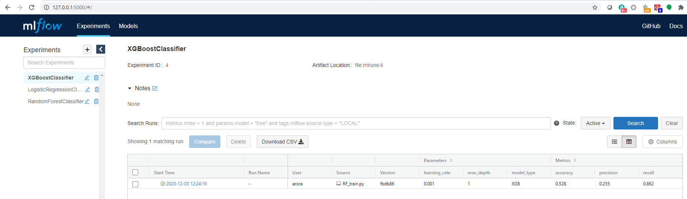

# MLFlow Model Serving for XGBoost and Scikit-learn models
The repo contains code to train and serve following three classification models trained on same data via MLFlow. The trained models are then saved under their respective experiment locations which can be viewed via the MLFlow GUI. The admin can choose one or models they want to serve for inference.

1) Random Forest (RF)
2) XGBoost (XGB)
3) Logistic Regression (LR)


## Steps to run this on a local machine (tested on Ubuntu 18.04)

#### Setup
1) Clone this repo to the local machine
2) cd into the cloned directory
3) Copy the data csv file named as "final.csv" in to the data folder
4) Ensure you have got conda installed in the machine. If not, install from offcial [Anaconda](https://docs.anaconda.com/anaconda/install/) site
5) Run command ```conda init``` followed by ```source ~/.bashrc```


### Create anaconda environment
1) Run command ```conda env create -f environment.yml```

### Spin-up MLFlow GUI
1) Run command ```mlflow server --backend-store-uri file://</full-path-to-mlruns-directory> --default-artifact-root file://</full-path-to-mlruns-directory> --host 0.0.0.0 --port 5000```
2) Open a browser and type 127.0.0.1:5000
3) At this point you should be able to see all experiments that exist in the repo already and also any new experiments that you will run in your local machine




### Create experiments


Copy data file names final.csv to data folder

mlflow server --backend-store-uri file:///home/arora/work/mlflow-sklearn-classification/mlruns/ --default-artifact-root file:///home/arora/work/mlflow-sklearn-classification/mlruns --host 0.0.0.0 --port 5000


##### To run directly from github
```mlflow run https://github.com/mlflow/mlflow-example.git -P train_test_split_size=0.33 random_state=2```
where all parameters can be passed after -P


mlflow models serve -m "/home/arora/work/mlflow-sklearn-classification/mlruns/0/d76ff64363f2492b8788bd46f4dc7a13/artifacts/random_forest_model" -h 0.0.0.0 -p 2125
