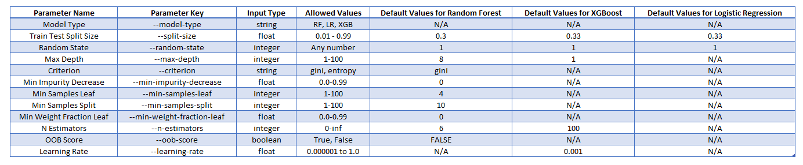

# MLFlow Model Serving for XGBoost and Scikit-learn models
The repo contains code to train and serve following three classification models trained on same data via MLFlow. The trained models are then saved under their respective experiment locations which can be viewed via the MLFlow GUI. The admin can choose one or more models they want to serve for inference.

1) Random Forest (RF)
2) XGBoost (XGB)
3) Logistic Regression (LR)


## Steps to run this on a local machine (tested on Ubuntu 18.04)

#### Setup
1) Clone this repo to the local machine
2) cd into the cloned directory
3) Ensure you have got conda installed in the machine. If not, install from official [Anaconda](https://docs.anaconda.com/anaconda/install/) site
4) Run command ```conda init``` followed by ```source ~/.bashrc```
5) Copy the data csv file named as "final.csv" in to the data folder


### Create anaconda environment
1) Run command ```conda env create -f environment.yml```


### Training models and running experiments
1) To run a Random Forest experiment with default parameters, simply run command ```python train.py```

*Note that user can run any of the three models with different parameters as explained below in Paramaters section by passing the parameter value after the command*
Examples - 
* To train XGBoost model with all default values as in the original code, simply run ```python train.py --model-type XGB```
* To train Logistic Regression model with all default values as in the original code, simply run ```python train.py --model-type LR```
* To run a Random Forest experiment with a max depth value of 10 (max_depth default value is 8 for Random Forest), just run command '''python train.py --max-depth 10'''
* To run a XGBoost experiment with a max depth value of 4 (max_depth default value is 1 for XGBoost), just run command '''python train.py --model-type XGB --max-depth 10'''


### Spin-up MLFlow GUI
1) Run command ```mlflow server --backend-store-uri file://</full-path-to-mlruns-directory> --default-artifact-root file://</full-path-to-mlruns-directory> --host 0.0.0.0 --port 5000```
2) Open a browser and type 127.0.0.1:5000


### View and compare models
1) At this point user should be able to see all experiments that exist in the repo already and also any new experiments that you will run in your local machine in the MLflow GUI


2) Users can compare models based in evaluation metrices results and decide which model(s) they want to deploy


### Serving model(s)
1) To be able to serve model(s), user needs to know the artifact & model path of it. To view this, open a model in the MLFlow GUI as shown in screenshot below


2) Once you have the model opened, it should look something like below screenshot


3) To get the address of artifact and model, scroll down to the section called Artifacts
4) Expand the Experiment Name link on left (see screenshow below)
5) Copy the model path as highlighed in yellow in the below screenshot


6) There are chances that it might not show the full path of the artifact so user may have to prepend the current working directory so it becomes full path and also remove the file name at the end as we only need to input the directory path
7) Run command ```mlflow models serve -m "<full-path-to-artifact-directory-copied-in-above-step>" -h 0.0.0.0 -p 2125 --no-conda``` to serve the model

*Please note that it is not neccessary to use port 2125 but use could choose to use a different port too*

8) If user wishes to deploy more than one model, the same command as in step no. 6 can be used with new model artifact and a different port number


### Inference
1) Once a model is deployed, it is already being served at a REST endpoint . In this instance at, https://127.0.0.1:2125
2) To get predictions, one needs to send POST request on the endpoint
3) Below is an example of REST call using python

```
import pandas as pd
import requests
import json
dataset = pd.read_csv('data/final.csv')
dataset = dataset.iloc[:, dataset.columns != 'v6392']
data = dataset.sample(1)


all_cols = list(data.columns)
all_vals = data.values.tolist()

input_data = {"columns":all_cols,
              "data":all_vals}

response = requests.post(url='http://127.0.0.1:2125/invocations',
                         data=json.dumps(input_data),
                         headers={"Content-type": "application/json"}
                         )
response_json = json.loads(response.text)
print(response_json)
```

*Same code is available in repository as well. Please see file named as *


## Parameters
There are many parameters that we can experiment our models with. Below screenshot shows complete list of parameters, their default values and allowed values



## Run experiments directly from github
It is required to have data available to code for running experiments dorectly from github. So data should either be coming from cloud or if its a physical file not in cloud it should be available in code repository which is not the case as yet keeping data security in mind. But if you user wishes to run experiments directly from git then they can choose to add the file final.csv in data folder. Once that's done, please follow the below process -

1) Ensure you have got conda installed in the machine. If not, install from official [Anaconda](https://docs.anaconda.com/anaconda/install/) site
2) Ensure you have mlflow installed in your active conda environment. If not, run command ```conda install -c conda-forge mlflow```
3) Ensure you have access to internet
4) Run command ```mlflow run https://github.com/sumanshusamarora/mlflow-sklearn-classification.git -P model_type='RF' train_test_split_size=0.33'''

*User can pass any training parameters after the -P variable in the above command. The parameters are pretty much same as mentioned in Parameter section but the name may be slighly different. Refer the parameter section in [this](./MLproject) in the repository to see all names that can be passed as parameters*
